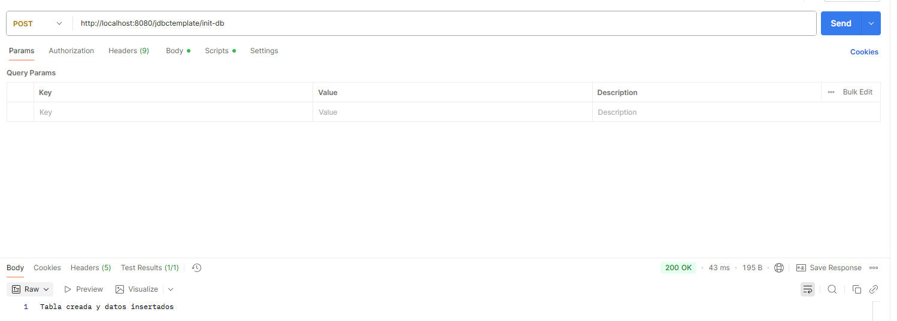
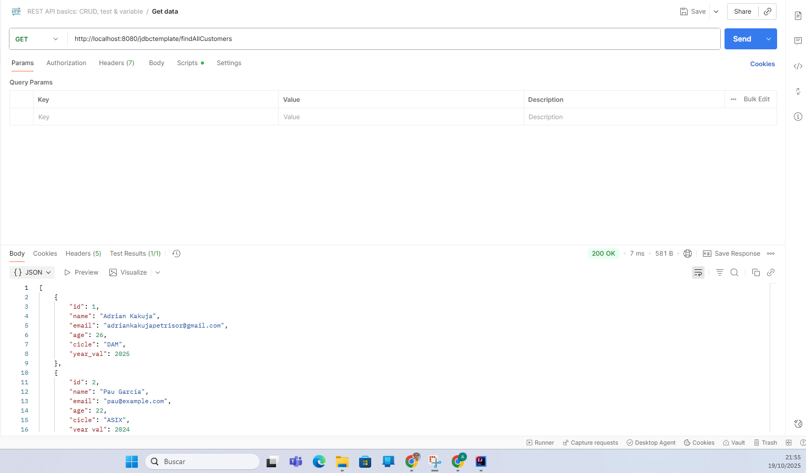
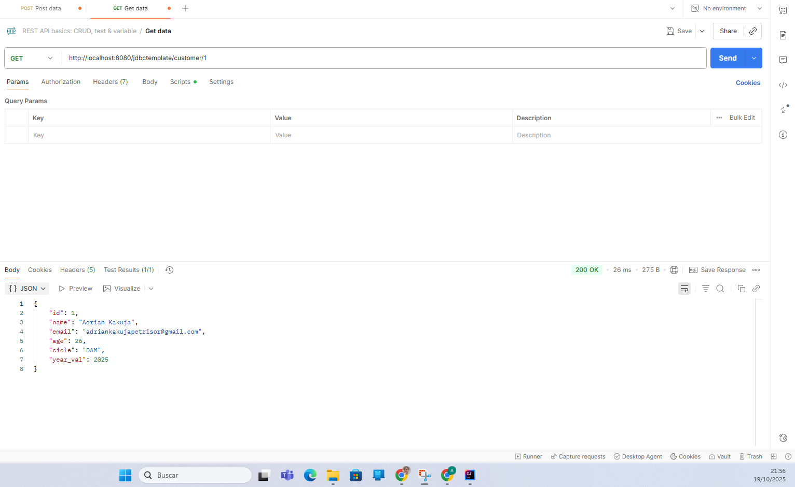
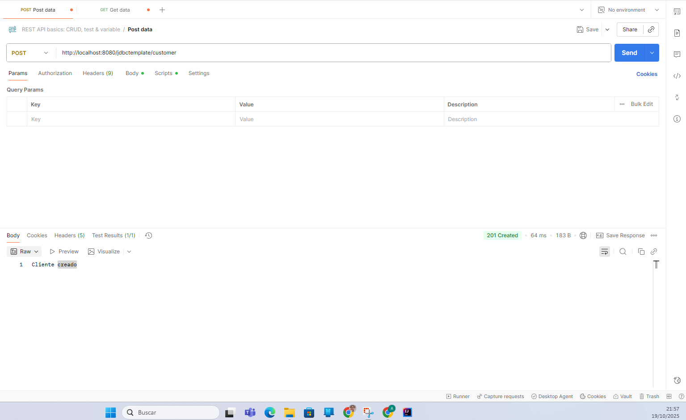
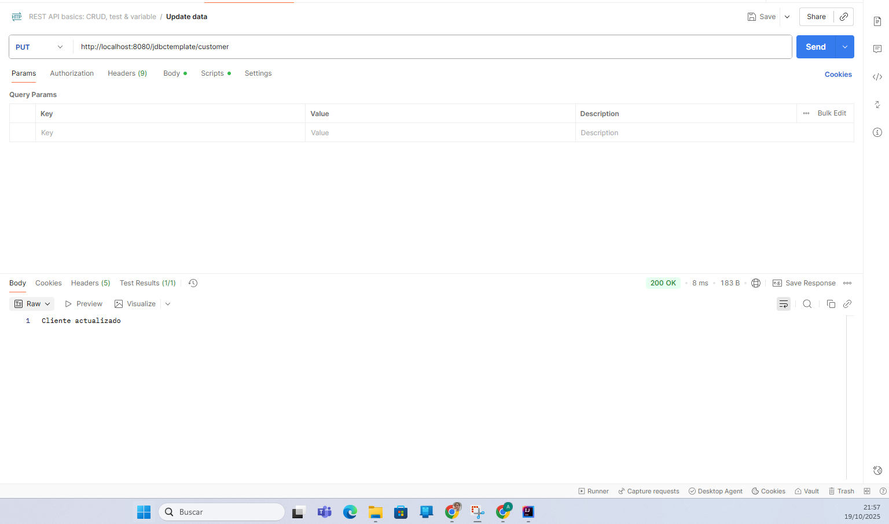
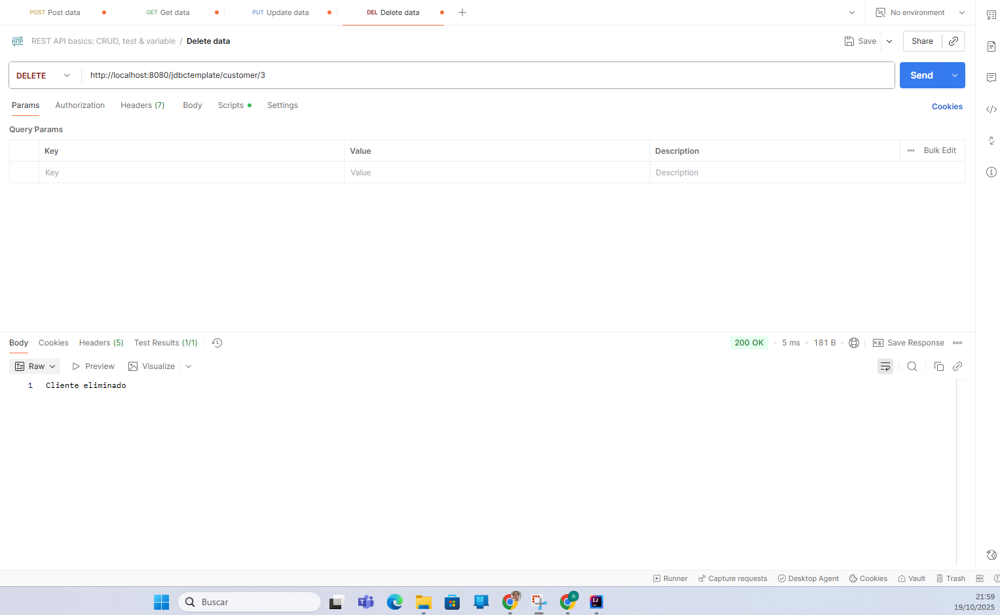

# DataAccess

END Point 1: Init DB
Inicia la base de datos

END POINT 2: Find all customers para seleccionar a todos los customers existentes en la DB

END POINT 3: Find by ID, para seleccionar solo el customer que queremos en concreto.

END POINT 4: Create Client, crea un nuevo cliente dentro de la base de datos(el ID se crea de forma automatica)

END POINT 5: Update Client, actualiza la información del cliente que queremos dentro de la DB

END POINT 6: Eliminate Client, elimina el cliente que especifiquemos de dentro de la DB
